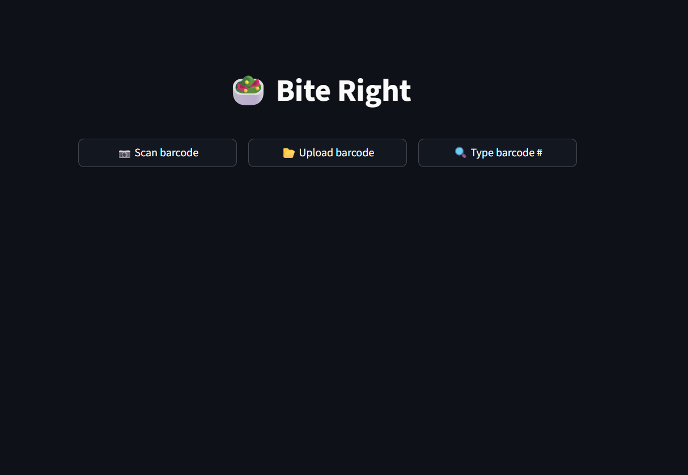
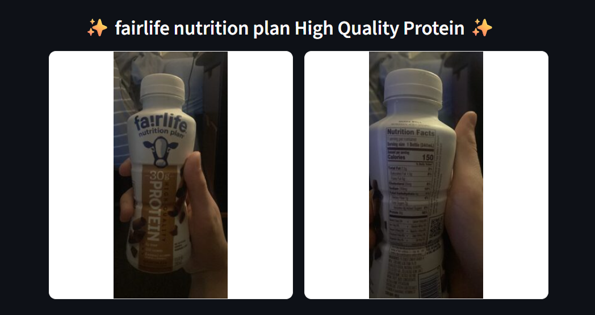
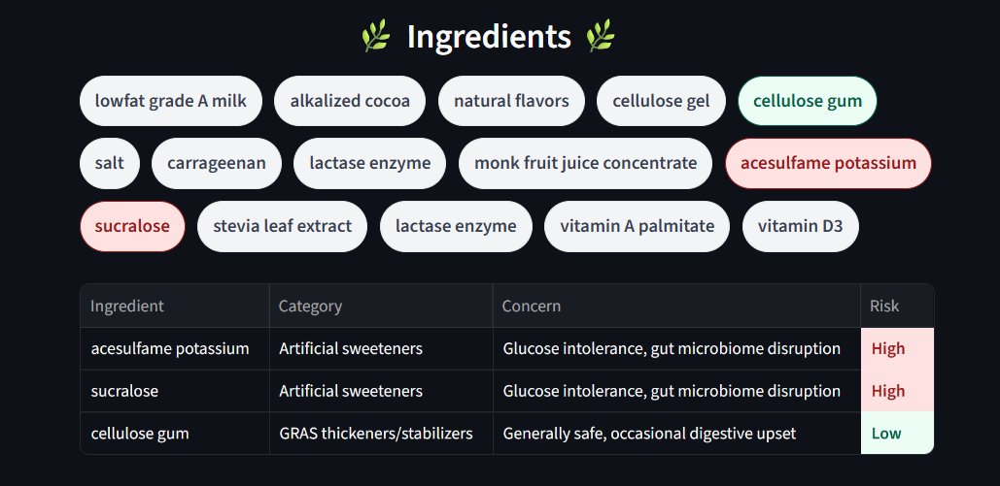
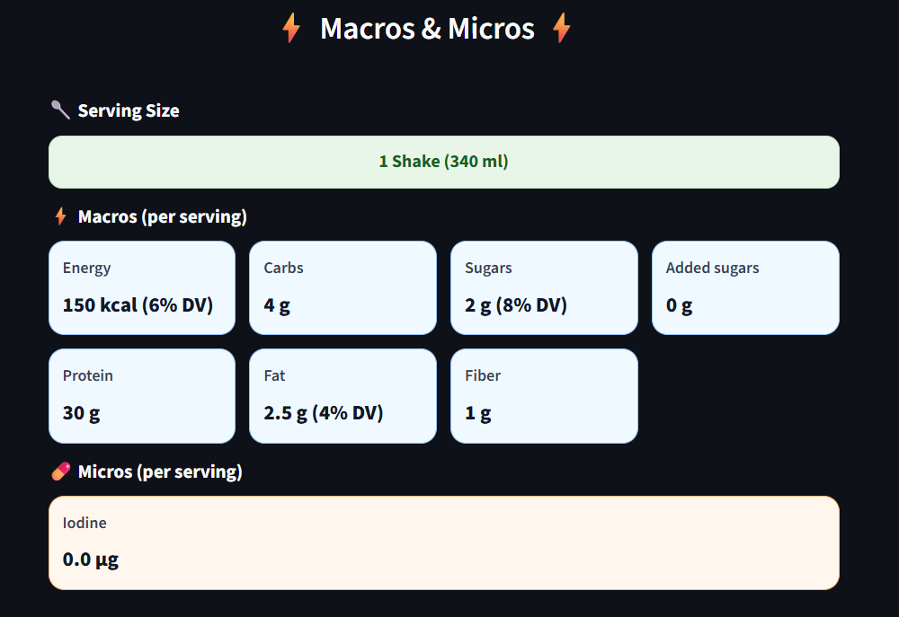

# 🥗 BiteRight – Food Ingredient Risk & Nutrition Dashboard  

**BiteRight is my personal project that I use very often** to quickly analyze packaged food products I buy and consume.  
It’s built in [Streamlit](https://streamlit.io) and designed to be both practical for everyday use

BiteRight is a Streamlit web app that helps you analyze packaged food products.  
It pulls nutrition and ingredient data (e.g. from OpenFoodFacts), and displays them in a clean, color-coded dashboard highlighting:

- 📦 Serving size  
- ⚡ Macros (energy, carbs, sugars, protein, fat, etc.)  
- 💊 Micros (vitamins & minerals)  
- 🌿 Ingredients with risk levels (High / Moderate / Low / Unknown)  

The app uses a harmful ingredient risk list CSV to highlight unsafe additives and show why they might be harmful.  
It also supports a custom **Daily Values CSV** to calculate **%DV (percent of daily value)** for macros like sugars, fat, saturated fat, and sodium.

---

## ✨ Features

- 📷 type, Upload or capture product barcode image.  
- 🖼 Side-by-side display of front image & nutrition label.  
- 📦 serving size banner.  
- ⚡ Macros in blue-themed tiles, with **(xx% DV)** based on your personal daily values.  
- 💊 Micros in orange-themed tiles.  
- 🌿 Ingredient with risk-based colors:  
  - 🔴 High Risk  
  - 🟡 Moderate Risk  
  - 🟢 Low Risk  
  - 🔵 Unknown   
- 📊 Risk concern table: ingredients from the risk list are displayed in a table with their category, concern, and risk color-coded for clarity.  
- 🔢 Personalized nutrition insights: e.g. `Sugar: 5 g (20% DV)`.

---

## 📂 Data Files

- `harmful_ingredients_risk_list.csv` → Used to map ingredients to risk categories and concerns.  
- `daily_values.csv` → Stores your personal daily targets (Calories, Fat, Saturated Fat, Sugar, Sodium, etc.), used for %DV calculations.  

---

## 🚀 Example Output

- **brand and product name**
- **front image and back image**
- **Ingredient**
- **Risk Concern Table**
- **Macros**
- **Micros**

---

## 🛠 Tech Stack

- **Frontend/Backend**: [Streamlit](https://streamlit.io)  
- **Data**: OpenFoodFacts API, CSV files (risk list + daily values)  
- **Language**: Python (pandas, regex, etc.)

---

